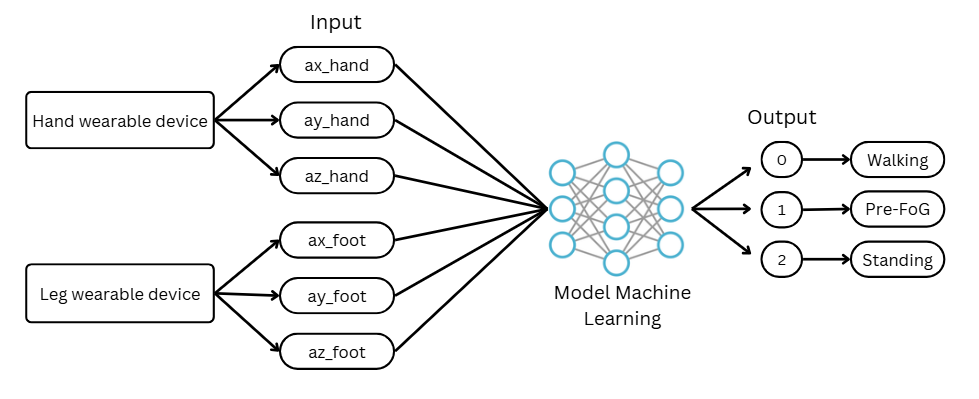

# **FOG-Parkinson**

  

<i>The operating principle of machine learning model.</i>

---

## **Abstract**

This study presents the development of a wearable system for predicting and early warning of Freezing of Gait (FoG) in Parkinson’s disease patients. FoG is a critical motor symptom that often occurs unexpectedly, increasing the risk of falls and serious injuries. The proposed system integrates an inertial measurement unit (MPU6050), real-time signal processing, and an optimized deep learning model to detect early signs of FoG.

Motion data from both hand and leg are collected and preprocessed through noise filtering, normalization, and sliding window segmentation. A lightweight Multi-Layer Perceptron (MLP) model is designed to classify three movement states: Walking, Standing, and Pre-FoG. The model is optimized for deployment on low-resource embedded systems, ensuring fast inference and low computational cost.

  

<i>The Multi-Layer Perceptron architecture was designed by the research team.</i>

The system operates in real time by transmitting sensor data to a server for prediction. When a Pre-FoG state is detected, an audio alert is triggered to warn the user, helping reduce the risk of falls. 

---

## **Results (Accelerometer Signal Analysis)**

To analyze motion characteristics, accelerometer (ACC) signals along three axes (x, y, z) were collected from both foot and hand IMU sensors under different movement states.

  
 
<i>Figure 1. Accelerometer signals in the standing state across foot and hand IMU sensors.</i>

In the standing state, the accelerometer signal remains nearly constant with minimal fluctuations, indicating a stable and stationary condition.

  
 
<i>Figure 2. Accelerometer signals in the walking state across foot and hand IMU sensors.</i>

In the walking state, the signal exhibits periodic and stable oscillations, representing regular gait cycles and consistent movement patterns.

  
 
<i>Figure 3. Accelerometer signals in the Freezing of Gait (FoG) state across foot and hand IMU sensors.</i>

In the FoG state, the signal shows irregular, high-frequency fluctuations and instability, resembling tremor-like movements. These abnormal patterns are clearly distinguishable from normal walking behavior and serve as critical features for FoG detection.

## **Contributors**
**Quan Cao**  
**Lam Phuc**
